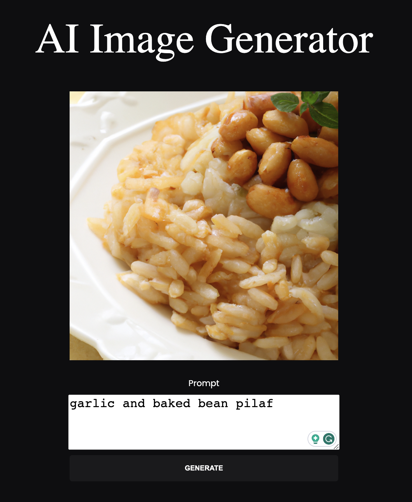

# Image Generator 

This project is a web application that utilizes the OpenAI API to generate images based on a given text prompt by the user.

## Technologies

This application is built with vanilla Javascript.

## Inspiration

I was inspired by the Fireship introductory Javascript course.

## How to use 

1. Clone the repository
2. `npm install` in the repo
3. Run the server `node server.js`
4. Run the application `npm run dev`
5. Start Generating!

